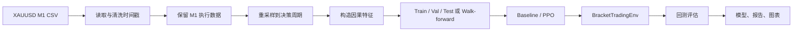
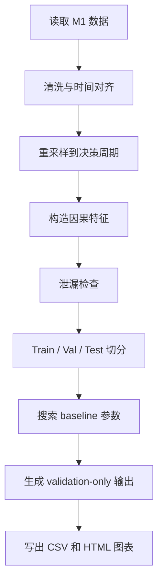

# XAUUSD 强化学习交易项目中文使用说明

> 上级：[`OVERVIEW.md`](OVERVIEW.md)

这份文档根据原作者教程内容，对照当前项目源码整理。它的重点不是证明某个策略一定盈利，而是说明如何复现实验、理解数据流、知道每个脚本负责什么，以及如何正确查看结果。

## 项目定位

本项目是一个面向 XAUUSD 黄金分钟数据的强化学习交易研究框架。它使用 MT4/MT5 风格的 M1 数据作为真实执行层，在更高周期上做交易决策，训练 PPO agent 学习 bracket trading：什么时候做多、做空、空仓，以及使用哪组止损和止盈参数。

核心链路如下：



原作者教程强调的几个原则，在项目里都有对应实现：

- 不直接把绝对价格喂给模型，而是使用 ATR-normalized、比例类、session 类特征。
- 不用随机切分，而是按时间顺序切分，并通过 walk-forward 检验跨时期稳定性。
- 不只看单次 test，而是用多个 out-of-sample fold 观察一致性。
- 用 M1 子周期模拟 TP/SL 命中，避免只看 H1 蜡烛时无法判断先止盈还是先止损。
- 训练时保留 sealed holdout，最终只揭盲一次。

## 快速开始

进入项目目录：

```bash
cd /Users/shancw/workspace/Reinforcement_Trading_Part_2
```

安装依赖：

```bash
pip install -r requirements.txt
```

准备数据文件。默认主数据路径在 `config.py` 中：

```python
csv_path = Path("data/XAUUSD_1 Min_Bid_2003.05.05_2026.05.31.csv")
time_col = "Time (EET)"
```

CSV 格式应类似：

```csv
Time (EET),Open,High,Low,Close,Volume
2020.01.09 01:00:00,1557.152,1557.452,1555.202,1555.302,0.045
```

先跑轻量 pipeline，确认数据读取、特征、baseline、图表输出都正常：

```bash
python run_pipeline.py
```

再跑 PPO 训练：

```bash
python train_ppo.py
```

如果需要最终 sealed holdout 揭盲：

```bash
python final_holdout_eval.py
```

## 重要文件对照

### `config.py`

全局配置入口。常改的参数都在这里，包括数据路径、时间周期、切分比例、交易成本、风控、reward shaping、PPO 正则化、walk-forward 设置。

关键默认值：

```python
execution_timeframe = "1min"
decision_timeframe = "H1"
source_tz = "Europe/Helsinki"
timestamp_is_bar_open = True
train_frac = 0.8
val_frac = 0.1
test_frac = 0.1
split_embargo_bars = 200
risk_fraction = 0.005
```

其中 `execution_timeframe` 是真实执行层，默认保留 M1；`decision_timeframe` 是 agent 观察和行动的周期，默认 H1。

`timestamp_is_bar_open = True` 表示 MT4/MT5 导出的时间戳被视为 candle open time，项目内部会把索引平移到 candle close time。这样每个决策时刻都表示“这根 K 线已经收完，可以被模型看到”，避免未来函数。

### `data_loader.py`

负责读取 CSV、解析 broker/EET 时间、清洗 OHLCV、处理时区、重采样，以及生成 train/val/test 或 walk-forward folds。

它是数据可信度的第一层。若你的数据源不是 EET/EEST，或时间戳已经是 bar close time，优先改 `config.py`，不要直接改后续训练逻辑。

### `features.py`

负责构造模型 observation features。项目尽量避免使用绝对价格，而是使用更平稳的相对特征，例如：

- Close 相对 EMA20/EMA50/EMA200 的 ATR 距离。
- EMA20 与 EMA50 的 ATR 距离。
- MACD histogram / ATR。
- ATR / Close。
- Bollinger width / Close。
- K 线实体、上下影线、区间相对 ATR 的比例。
- 最近多根 bar 的 ATR-normalized return。
- 小时、星期的 sin/cos 编码。
- Asia / London / New York session flags。

README 中说明当前 observation set 是 25 个特征，并删掉过 4 个高度共线特征：`rsi_centered`、`roc5_atr`、`body_atr`、`ema50_slope5_atr`。

### `env_bracket.py`

核心交易环境 `BracketTradingEnv`。PPO 训练时实际交互的就是这个 Gymnasium 环境。

每一步对应一个决策周期 bar。agent 输出的是一个 `MultiDiscrete` 动作：

```text
direction: 0 = flat / close, 1 = long, 2 = short
SL bucket: 从 sl_atr_multipliers 里选
TP bucket: 从 tp_r_multipliers 里选
```

默认 bracket 空间来自 `config.py`：

```python
sl_atr_multipliers = (1.0, 1.5, 2.0)
tp_r_multipliers = (1.0, 1.5, 2.0, 3.0)
```

所以 agent 不是只判断买卖，而是同时选择方向、止损 ATR 倍数、止盈 R 倍数。

环境用 M1 candles 模拟下一段决策周期内 TP/SL 的真实触发顺序。如果同一根 M1 candle 同时触及 TP 和 SL，项目采用保守假设：SL first。

### `baselines.py`

实现随机策略和 EMA/ATR 趋势跟随 baseline。`run_pipeline.py` 会搜索 baseline 参数，但默认只用 train/val，不碰 sealed test。

这部分的意义是给 PPO 一个可解释的比较对象。一个 RL agent 至少应该在 out-of-sample 上和简单 baseline 比较，否则单独看 PPO 收益没有意义。

### `run_pipeline.py`

预训练前的一键检查入口。它会完成：



常见输出在 `outputs/`：

```text
outputs/policy_search.csv
outputs/selected_policy.csv
outputs/performance_report.csv
outputs/selected_val_trade_log.csv
outputs/selected_val_equity_curve.csv
outputs/walk_forward_baseline.csv
outputs/01_val_candles_indicators.html
outputs/02_pretest_sessions_by_hour.html
outputs/03_pretest_feature_correlation.html
outputs/04_val_trades_on_chart.html
outputs/05_val_equity_drawdown.html
```

第一次复现时应先跑这个脚本。若这里报错，不要直接跑 PPO。

### `train_ppo.py`

PPO 训练入口。当前 README 说明默认入口是 sliding-window walk-forward，即 `train_sliding_walk_forward()`。

它模拟更接近真实部署的流程：

```text
用最近 5 年训练
用接下来 6 个月 validation 选 checkpoint
用后面 6 个月 out-of-sample test 评估
窗口整体向前滑 6 个月
重复直到历史结束
```

相关配置：

```python
sliding_train_years = 5.0
sliding_val_months = 6
sliding_test_months = 6
sliding_step_months = 6
```

每个 fold 会独立训练模型，并把 test window 的结果拼接成一条连续 OOS equity curve。

常见输出在 `models/`：

```text
models/sliding/fold_1/
models/sliding/fold_2/
models/sliding_walk_forward_summary.csv
models/sliding_oos_equity.csv
models/best_model/best_model.zip
models/best_model/best_model_vecnorm.pkl
models/run_info.json
models/NO_DEPLOY.txt
```

如果出现 `NO_DEPLOY.txt`，表示模型没有通过部署门控。此时可以继续研究结果，但不要把它当成可部署策略。

### `final_holdout_eval.py`

最终 sealed holdout 揭盲入口。它读取冻结后的模型和 vecnorm，对最后保留的 test split 做一次性评估。

典型输出：

```text
outputs/final_holdout/rl_test_equity_curve.csv
outputs/final_holdout/rl_test_trade_log.csv
outputs/final_holdout/holdout_report.csv
```

如果 `outputs/selected_policy.csv` 存在，它也会把 selected baseline 跑到同一个 holdout 上，便于和 RL 对比。

## 训练与评估逻辑

### Reward function

Reward 在 `env_bracket.py` 的 `step()` 中计算，核心思想是用风险预算归一化收益，而不是直接用现金 PnL：

```python
reward = (self.equity - prev_equity) / reward_risk_unit
```

如果持仓未平，还会加入小权重 unrealized PnL 和持仓惩罚：

```python
reward += (unrealized / self.position.risk_cash) * self.reward_mtm_weight
reward -= self.holding_penalty
```

对应配置：

```python
holding_penalty = 0.00002
reward_mtm_weight = 0.01
risk_fraction = 0.005
```

这部分是最值得实验的区域之一。不同 reward shaping 会明显改变 agent 行为：更爱短线、趋势持仓、减少无效持仓，或者变得过度保守。

### Checkpoint 选择

项目不会简单选择最后一个 checkpoint，而是用一致性评价挑选模型。核心思想是不要让 train 很好但 val 崩掉的模型胜出。

选择逻辑大致是：

```text
train_eval_quality = train_reward - drawdown_penalty
val_quality = val_reward - drawdown_penalty
score = min(train_eval_quality, val_quality)
```

也就是取 train-tail 和 validation 的短板。它还带有 do-nothing guard：如果交易次数太少，或 train/val reward 不达标，不会因为低回撤就被当成好模型。

### Consistency Gate

所有 fold 完成后，项目用部署门控判断是否允许推广最终模型。

相关配置：

```python
min_consistent_folds = 4
gate_min_profit_factor = 1.0
gate_worst_fold_min_pf = 0.9
gate_require_mean_sharpe_positive = True
```

它检查的问题是：

- 是否足够多 fold 同时满足收益为正和 profit factor 达标。
- 最差 fold 是否没有烂到不可接受。
- 平均 Sharpe-like 是否为正。

这一步非常重要。单个窗口赚钱可能只是碰巧，多个不同时段都稳定才更接近真实 edge。

## 推荐运行顺序

建议按这个顺序复现：

```bash
cd /Users/shancw/workspace/Reinforcement_Trading_Part_2
pip install -r requirements.txt
python run_pipeline.py
python train_ppo.py
python final_holdout_eval.py
```

实际操作时不要急着运行最后一步。先看 `run_pipeline.py` 是否正常，再看 `train_ppo.py` 的多折结果。如果模型没有通过 gate，最终 holdout 结果也不应该被包装成成功策略。

## 如何看结果

不要只看 total return。至少同时检查：

- `total_return_pct`
- `annualized_return_pct`
- `max_drawdown_pct`
- `sharpe_like`
- `profit_factor`
- `win_rate_pct`
- `avg_r`
- `n_trades`

需要警惕的情况：

- Train 很高，validation 或 test 明显掉：大概率过拟合。
- 只有某一折暴赚，其他 fold 平庸或亏损：可能只是运气。
- 交易次数极少但收益很高：统计不稳定。
- Profit factor 很高但 n_trades 很少：不可靠。
- 最大回撤很大：收益路径风险过高。
- Long 或 short 极度偏一边：可能只是吃到了单边行情。

最有参考价值的文件通常是：

```text
models/sliding_walk_forward_summary.csv
models/sliding_oos_equity.csv
models/run_info.json
models/NO_DEPLOY.txt
outputs/final_holdout/holdout_report.csv
```

## 最适合修改的地方

如果要继续研究，优先改这些位置：

### 调整数据与时间周期

文件：`config.py`

```python
csv_path
decision_timeframe
source_tz
timestamp_is_bar_open
```

适用于切换数据源、从 H1 改成 M15/H4、处理不同时区 broker 数据。

### 调整交易成本与风控

文件：`config.py`

```python
spread_price
slippage_price
commission_per_trade
risk_fraction
```

这会直接影响策略是否还能盈利。回测成本假设太乐观，结果会失真。

### 调整 bracket 空间

文件：`config.py`

```python
sl_atr_multipliers
tp_r_multipliers
```

这决定 agent 可以选择哪些止损/止盈组合。空间过小会限制策略，空间过大则更难训练。

### 调整特征

文件：`features.py`

可以加入 regime、volatility、session、macro filter 等特征，但必须保持因果性：每个 timestamp 的特征只能使用当时及之前已经完成的数据。

### 调整 reward function

文件：`env_bracket.py`

适合研究持仓惩罚、未实现盈亏提示、回撤惩罚、交易频率惩罚等。但每次只改一个方向，避免结果不可解释。

### 调整训练稳定性

文件：`config.py` 和 `train_ppo.py`

相关参数包括：

```python
ppo_learning_rate
ppo_ent_coef
ppo_n_epochs
ppo_clip_range
ppo_target_kl
ppo_weight_decay
ppo_net_arch
```

若出现训练集很好但验证集崩掉，通常优先降低学习率、提高正则化、减少训练步数或加强 checkpoint selection。

## 常见坑

### 时间戳错位

如果你的 CSV 时间戳已经是 candle close time，却保留 `timestamp_is_bar_open = True`，项目会多平移一次，导致所有决策和成交错位。

### 反复看 holdout

`final_holdout_eval.py` 应该只在模型冻结后运行。反复根据 holdout 调参，会让 holdout 变成新的 validation。

### 使用绝对价格特征

XAUUSD 跨年份价格尺度变化明显，直接输入 Close/Open/High/Low 容易让模型学到非平稳关系。应优先使用 ATR-normalized 或比例特征。

### 只看最后 checkpoint

PPO 后期可能过拟合。应优先使用项目选择出的 `best_model`，而不是训练结束时的最后模型。

### 忽略交易成本

黄金短线策略对 spread、slippage 非常敏感。回测前必须确认成本假设接近目标 broker。

## 一句话总结

正确使用这个项目的方式是：先用干净的 M1 数据建立可信的因果特征和执行模拟，再用 baseline 校验流程，然后用 sliding walk-forward 训练和评估 PPO，最后只在模型冻结后揭盲 sealed holdout。真正有价值的不是单次漂亮收益曲线，而是多折 out-of-sample 是否稳定、是否通过 consistency gate，以及在真实交易成本下是否仍然成立。
